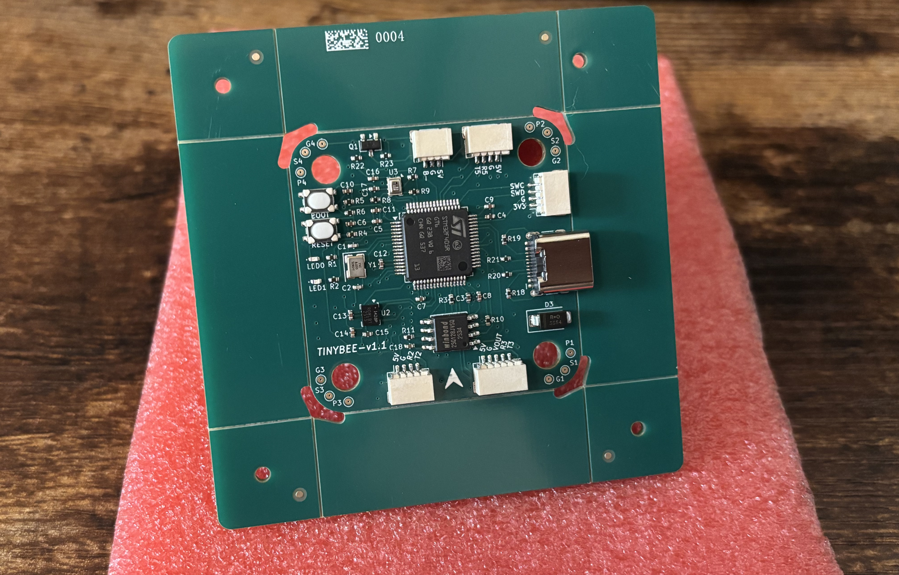
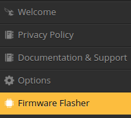
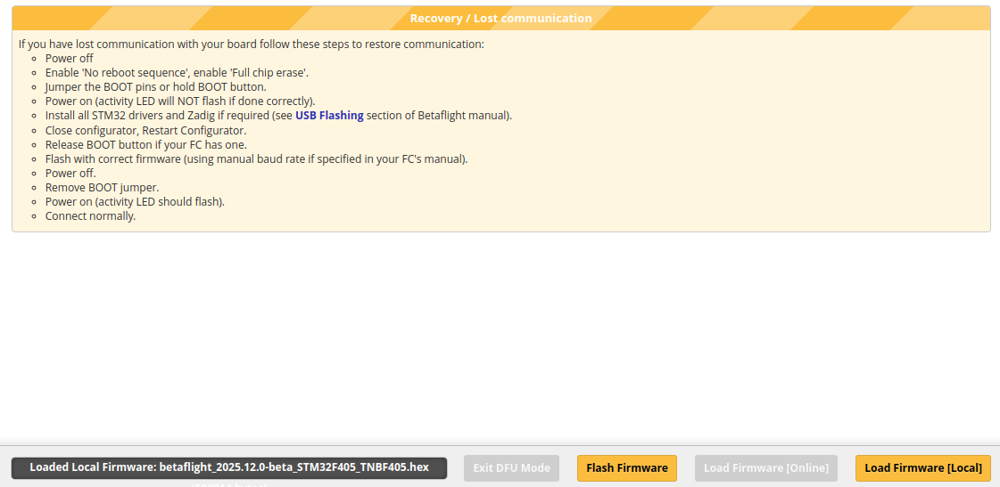
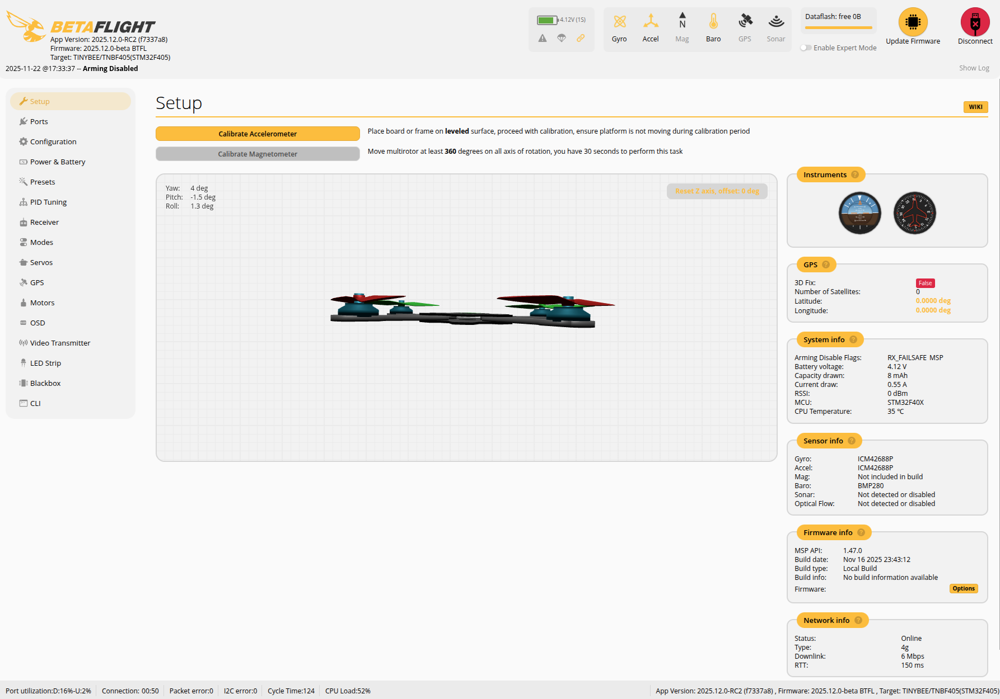
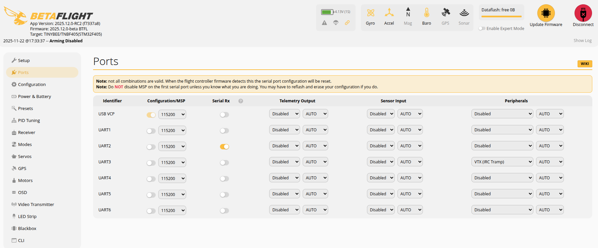

# TINYBEE

This repository contains the hardware design of tinybeef405 flight controller, It supports the latest betaflight firmware currently, you can build your own firmware with the configuration files in the `configs` directory, see the details below.

I personally use this flight controller board as a hardware platform to learn betafight source code and stm32 microcontrollers, related videos were posted on my [Bilibili](https://space.bilibili.com/258537970) account.



## Hardware and Features

- MCU: STM32F405
- IMU: ICM42688-P
- BARO: BMP280
- OSD: BetaFlight OSD, AT7456E
- Blackbox: 128MiB onboard flash, W25Q128JVSIQ
- UARTS: UART2/UART4/UART5
- SWD: Yes
- Digital VTX: Yes
- LEDs: LED0/LED1
- LED Strip: Yes
- Beeper: Yes
- Boot button: For easy entry into DFU mode

## Firmware build and flash

1. Get the latest betaflight source code

```shell
$ git clone https://github.com/betaflight/betaflight.git
$ cd betaflight
$ git submodule init && git submodule update --recursive
```

2. Copy config files

```shell
# download tinybee first, and then...
$ cp -r tinybee/configs/TNBF405 betaflight/src/config/configs
```

3. Build firmware

```shell
$ cd betaflight
$ make arm_sdk_install
$ make TNBF405
# wait until make completes its job, you will get:
$ ls obj
betaflight_2025.12.0-beta_STM32F405_TNBF405.hex  main
# "betaflight_2025.12.0-beta_STM32F405_TNBF405.hex" is what you need
```
4. Flash firmware

    - With [Betaflight Configurator](https://github.com/betaflight/betaflight-configurator/releases) properly installed and opened

    - Connect tinybee flight controlelr via usb

    - Enter DFU mode, press and hold the `BOOT` button, then press the `RESET` button

    - Go to the `Firmware Flasher` tab

        

    - Load local firmware then flash firmware

        

5. Basic configurations

    You need to do at least the following setups so that your drone works.

    - `Ports`: select the right ports for RX and VTX
    - `Motors`: make sure the order and direction are both ok
    - `Modes`: how to arm your drone and switch to other modes
    - `VTX`: analog or digital
    - `OSD`: analog or digital

    For more information see [the betalfight wiki](https://www.betaflight.com/docs/wiki/getting-started/setup-guide).
    
    If everything goes well, the final result will be like this:

    

    

## Special Thanks

- [The original AcciF405 FC Design](https://oshwlab.com/jesuslg123/f4-v1)
- [Betaflight Project](https://www.betaflight.com/)
